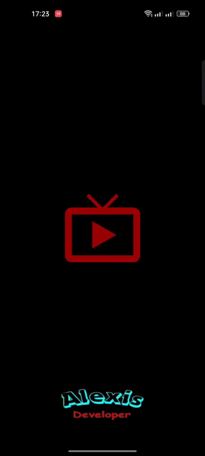

# APP Movies

Aplicación móvil construida en Kotlin que te permite explorar las películas más populares del momento, guardar tus películas favoritas y ver sus detalles. 
 
Para este desarrollo se hace uso de la API [TMDb (The Movie Database)](https://developer.themoviedb.org/docs) 

## Características del proyecto:

- Clean Architecture
- Arquitectura **MVVM**.
- Principios **SOLID**
- Integracion Continua **CI/CD**
- Corrutinas
- Retrofit
- Room
- Inyección de dependencias con **Dagger Hilt**
- Navigation Component
- JUnit
- Coroutines Test
- Mockk
- Splash optimizado
- ViewBinding
- SafeArgs
- Flows
- StateFlow
- DiffUtil
- Glide

## Presentation App

